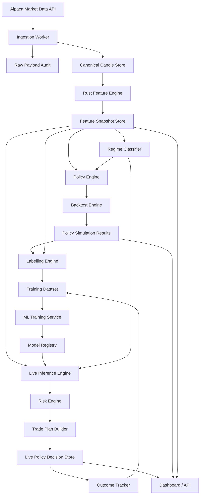
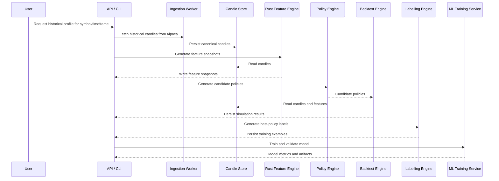
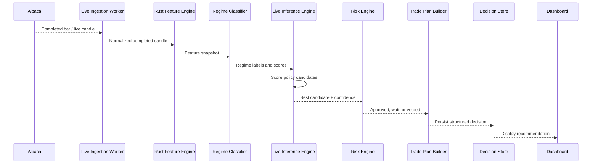
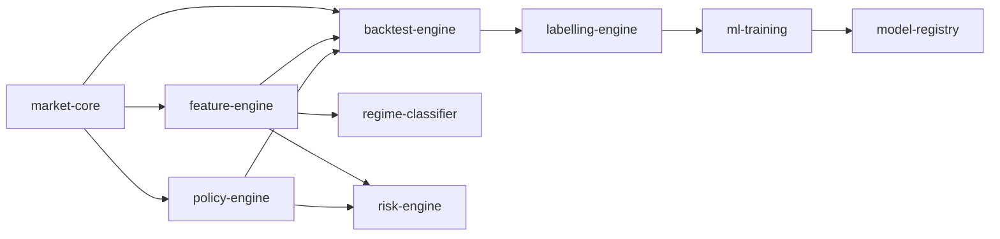

# Component Map

This document maps the main components of the trade engine and explains how data moves through the system.

## Component overview



## Primary components

| Component | Runtime | Purpose |
| --- | --- | --- |
| Ingestion Worker | TypeScript / NestJS initially | Pull historical and live market data from Alpaca and normalize it. |
| Canonical Candle Store | Postgres + Parquet | Store clean OHLCV candles and provider metadata. |
| Feature Engine | Rust | Generate deterministic market-state features from candle data. |
| Regime Classifier | Rust initially | Classify trend, range, volatility, liquidity and session states. |
| Policy Engine | Rust | Generate valid candidate trade behaviours. |
| Backtest Engine | Rust | Simulate candidate policies across historical data. |
| Labelling Engine | Rust / Python boundary | Convert simulation outcomes into supervised training labels. |
| ML Training Service | Python | Train, evaluate and calibrate models. |
| Model Registry | TypeScript + DB / MLflow later | Track model versions, feature schemas and promotion state. |
| Live Inference Engine | Rust + Python/ML service | Score current feature snapshots and recommend policy behaviour. |
| Risk Engine | Rust | Apply deterministic vetoes and hard risk controls. |
| Trade Plan Builder | TypeScript or Rust | Convert selected policy into a structured trade plan. |
| Outcome Tracker | TypeScript worker | Track whether live recommendations won, lost, waited or expired. |
| API / Dashboard | TypeScript | Expose reports, decisions, features and model performance. |

## Batch research flow



## Live flow



## Component dependency direction

The architecture should avoid circular dependency between services and packages.

Recommended dependency direction:



Rules:

```text
market-core should not depend on any higher-level engine.
feature-engine should not depend on ML models.
policy-engine should not depend on backtest results.
risk-engine should be deterministic and independently testable.
ML training should consume generated features and labels, not redefine them.
```

## Shared contracts

The most important shared contracts are:

```text
Candle
SpreadSnapshot
FeatureSnapshot
RegimeSnapshot
CandidatePolicy
PolicySimulationResult
TrainingExample
ModelRun
LivePolicyDecision
TradePlan
OutcomeResolution
```

These contracts should be versioned as schemas before implementation begins.

## Documentation index

| Document | Component |
| --- | --- |
| [`01-ingestion-worker.md`](01-ingestion-worker.md) | Alpaca historical and live data ingestion. |
| [`02-candle-store.md`](02-candle-store.md) | Canonical candle storage and raw audit. |
| [`03-rust-feature-engine.md`](03-rust-feature-engine.md) | Deterministic feature calculation. |
| [`04-regime-classifier.md`](04-regime-classifier.md) | Market regime classification. |
| [`05-policy-engine.md`](05-policy-engine.md) | Candidate policy generation. |
| [`06-backtest-engine.md`](06-backtest-engine.md) | Historical simulation and scoring. |
| [`07-labelling-engine.md`](07-labelling-engine.md) | Best-policy and no-trade labelling. |
| [`08-ml-training-service.md`](08-ml-training-service.md) | Model training and evaluation. |
| [`09-live-inference-and-risk.md`](09-live-inference-and-risk.md) | Live prediction, risk gate and trade plan flow. |
| [`10-api-dashboard.md`](10-api-dashboard.md) | API and dashboard surfaces. |
