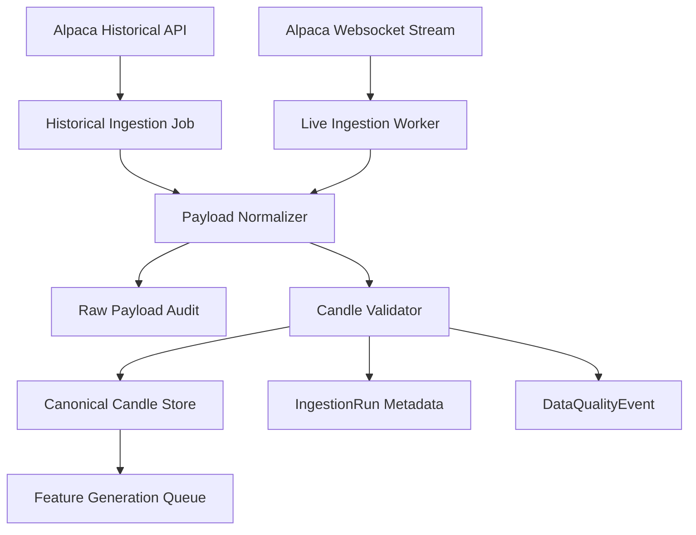
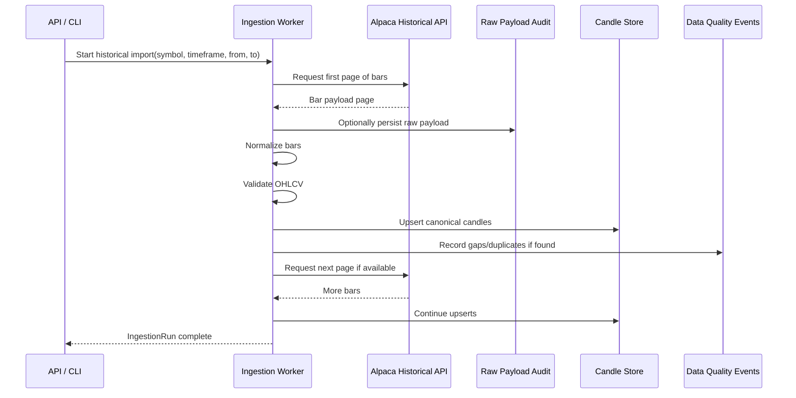
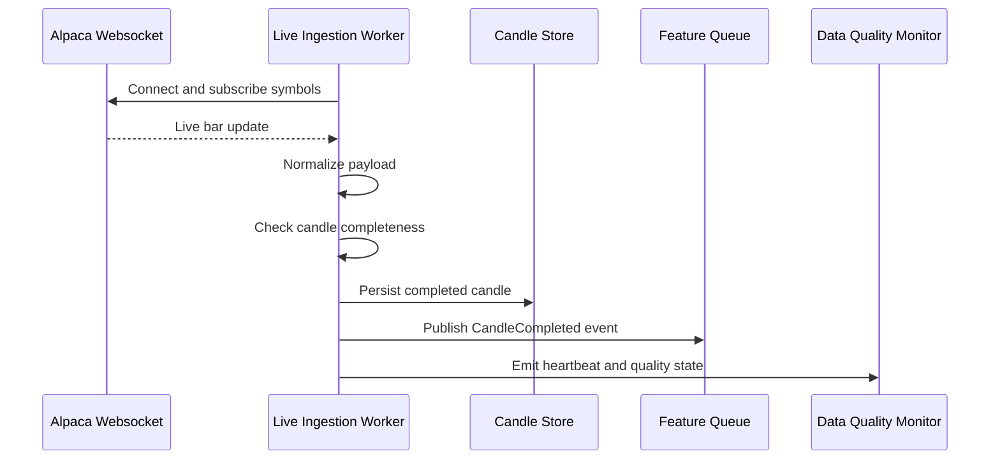

# Component: Ingestion Worker

## Purpose

The ingestion worker is responsible for collecting historical and live market data from Alpaca and converting provider payloads into the internal canonical candle format.

The ingestion worker should be intentionally simple. It should not calculate complex trading features, classify regimes or make trading decisions.

## Responsibilities

```text
fetch historical candles from Alpaca
subscribe to live Alpaca websocket streams
normalize provider payloads into Candle records
persist canonical candles
persist raw payload audit records when required
handle pagination
handle rate limiting
handle retries and reconnects
record ingestion run metadata
validate duplicates and gaps
publish completed candles for downstream feature generation
```

## Non-responsibilities

```text
feature calculation
backtesting
policy scoring
model inference
risk decisions
trade execution
```

## High-level flow



## Historical ingestion sequence



## Live ingestion sequence



## Input contracts

### Historical import request

```json
{
  "source": "alpaca",
  "symbols": ["AAPL", "MSFT"],
  "timeframe": "1Min",
  "from": "2025-01-01T00:00:00Z",
  "to": "2025-12-31T23:59:59Z",
  "feed": "iex",
  "adjustment": "raw"
}
```

### Live subscription request

```json
{
  "source": "alpaca",
  "symbols": ["AAPL", "MSFT"],
  "streams": ["bars"],
  "feed": "iex"
}
```

## Output contracts

### Normalized candle

```json
{
  "symbol": "AAPL",
  "timeframe": "1Min",
  "timestamp": "2026-07-02T14:31:00Z",
  "open": 100.12,
  "high": 100.30,
  "low": 100.05,
  "close": 100.22,
  "volume": 18200,
  "trade_count": 94,
  "vwap": 100.18,
  "source": "alpaca",
  "feed": "iex",
  "is_complete": true,
  "provider_metadata": {
    "adjustment": "raw"
  }
}
```

### Candle completed event

```json
{
  "event_type": "CandleCompleted",
  "symbol": "AAPL",
  "timeframe": "1Min",
  "timestamp": "2026-07-02T14:31:00Z",
  "candle_id": "uuid",
  "source": "alpaca"
}
```

## Ingestion run metadata

Each historical import should create an `IngestionRun`.

```text
id
source
symbols
timeframe
from
to
status
requested_count
inserted_count
updated_count
duplicate_count
gap_count
error_count
started_at
completed_at
config_json
```

## Data quality events

The ingestion worker should report:

```text
missing_candle_gap
duplicate_candle
invalid_ohlc
zero_volume
out_of_order_payload
provider_error
rate_limit_hit
websocket_reconnect
stale_live_feed
```

Example:

```json
{
  "type": "missing_candle_gap",
  "symbol": "AAPL",
  "timeframe": "1Min",
  "from": "2026-07-02T14:32:00Z",
  "to": "2026-07-02T14:36:00Z",
  "source": "alpaca",
  "severity": "warning"
}
```

## Validation rules

Basic candle validation:

```text
high >= open
high >= close
high >= low
low <= open
low <= close
open > 0
high > 0
low > 0
close > 0
volume >= 0
timestamp is aligned to timeframe
symbol is configured
```

Duplicate key:

```text
symbol + timeframe + timestamp + source
```

## Persistence strategy

### Operational store

Use Postgres for recent and queryable candles.

### Research store

Use Parquet for large historical datasets used by Rust batch jobs.

Recommended flow:

```text
Alpaca -> Postgres raw/normalized -> scheduled Parquet export -> Rust batch feature generation
```

Alternative for large backfills:

```text
Alpaca -> streaming Parquet writer -> Rust batch feature generation -> Postgres summary import
```

## Queue events

The ingestion worker should publish:

```text
HistoricalIngestionStarted
HistoricalIngestionCompleted
HistoricalIngestionFailed
CandleCompleted
LiveFeedConnected
LiveFeedDisconnected
DataQualityEventRaised
```

## Failure handling

For historical ingestion:

```text
retry transient provider errors
resume from last successfully persisted timestamp
record failed page metadata
avoid duplicate inserts through idempotent upserts
```

For live ingestion:

```text
automatic reconnect
resubscribe symbols
detect stale stream
backfill missed candles after reconnect
emit data quality event for any gap
```

## Configuration

```text
ALPACA_API_KEY
ALPACA_API_SECRET
ALPACA_DATA_BASE_URL
ALPACA_STREAM_URL
ALPACA_FEED
ALPACA_RATE_LIMIT_BACKOFF_MS
ALPACA_MAX_RETRIES
CANDLE_EXPORT_PATH
```

Do not store API secrets in repository files.

## Testing requirements

Unit tests:

```text
normalizes Alpaca bar payload
rejects invalid OHLC candles
aligns timestamp to timeframe
preserves provider metadata
creates deterministic candle keys
```

Integration tests:

```text
historical pagination resumes correctly
rate limit retry works
duplicate candle upsert is idempotent
live reconnect triggers missed-candle backfill
```

## Build order

1. Define `Candle` schema.
2. Implement historical bars importer.
3. Persist candles to Postgres.
4. Export candles to Parquet.
5. Add ingestion run metadata.
6. Add data quality events.
7. Add live websocket ingestion.
8. Add gap backfill after live reconnect.

## Open decisions

```text
Which Alpaca asset classes are required first: equities, crypto, forex?
Which feeds are available under the account?
Should Postgres or Parquet be the primary historical source of truth?
Should live feature generation consume candles from queue or directly from stream?
```
