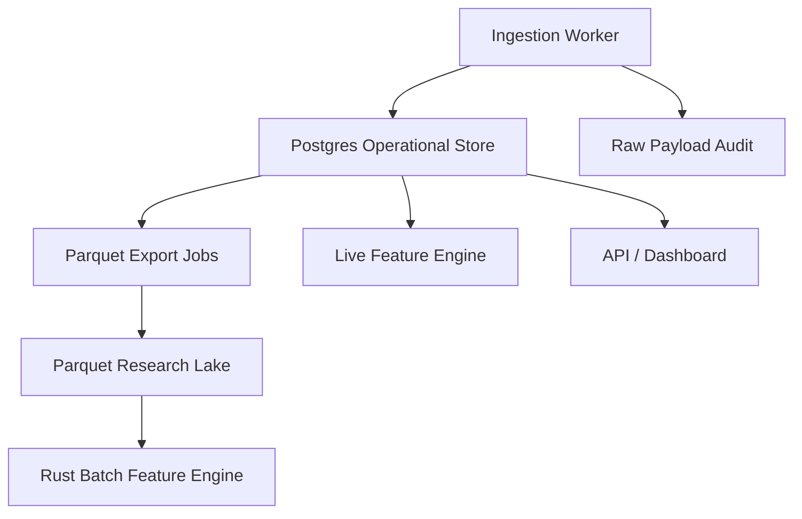
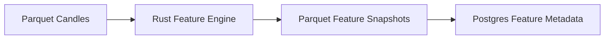
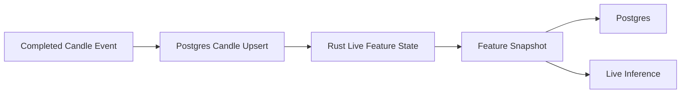

# Component: Candle Store

## Purpose

The candle store holds normalized historical and live market data in a form that can be consumed by the Rust feature engine, backtest engine, dashboard and reporting tools.

The store should support two usage patterns:

1. **Operational queries** for recent data, live decisions and dashboard views.
2. **Large research/backtest scans** over historical datasets.

## Recommended storage split



## Storage roles

### Postgres

Use Postgres for:

```text
recent candles
configured symbols/timeframes
ingestion run metadata
data quality events
feature snapshot metadata
live decisions
model metadata
dashboard API queries
```

### Parquet

Use Parquet for:

```text
large historical candle archives
feature matrices
training datasets
backtest result exports
walk-forward validation exports
```

Parquet is preferred for large analytical scans because it is columnar, compact and efficient for Rust/Python data processing.

## Canonical candle schema

```text
id
symbol
timeframe
timestamp
open
high
low
close
volume
trade_count
vwap
source
feed
is_complete
provider_metadata_json
created_at
updated_at
```

Recommended unique key:

```text
symbol + timeframe + timestamp + source + feed
```

## Candle entity example

```json
{
  "id": "uuid",
  "symbol": "AAPL",
  "timeframe": "1Min",
  "timestamp": "2026-07-02T14:31:00Z",
  "open": 100.12,
  "high": 100.30,
  "low": 100.05,
  "close": 100.22,
  "volume": 18200,
  "trade_count": 94,
  "vwap": 100.18,
  "source": "alpaca",
  "feed": "iex",
  "is_complete": true,
  "provider_metadata": {
    "adjustment": "raw"
  }
}
```

## Raw payload audit

Raw payload storage is useful for debugging provider issues and reprocessing historical data when the internal schema changes.

Suggested fields:

```text
id
source
endpoint_or_stream
request_key
payload_json
received_at
hash
```

Do not rely on raw payloads for feature generation. The canonical candle table is the normalized source.

## Ingestion run schema

```text
id
source
symbols_json
timeframe
from_timestamp
to_timestamp
status
requested_count
inserted_count
updated_count
duplicate_count
gap_count
error_count
started_at
completed_at
config_json
error_json
```

## Data quality event schema

```text
id
source
symbol
timeframe
from_timestamp
to_timestamp
event_type
severity
details_json
created_at
```

Event types:

```text
missing_candle_gap
duplicate_candle
invalid_ohlc
zero_volume
out_of_order_payload
provider_error
rate_limit_hit
stale_live_feed
```

## Feature snapshot store

Although the feature engine is separate, the candle store should define how feature snapshots are persisted.

Suggested schema:

```text
id
symbol
timeframe
timestamp
feature_schema_version
calculation_config_hash
features_json
created_at
```

Unique key:

```text
symbol + timeframe + timestamp + feature_schema_version + calculation_config_hash
```

## Parquet partitioning

Recommended partitioning:

```text
data/
  candles/
    source=alpaca/
      symbol=AAPL/
        timeframe=1Min/
          year=2026/
            month=07/
              candles.parquet
```

Feature partitioning:

```text
data/
  features/
    schema=v1.0.0/
      symbol=AAPL/
        timeframe=1Min/
          year=2026/
            month=07/
              features.parquet
```

Training dataset partitioning:

```text
data/
  training/
    label_schema=v1.0.0/
      feature_schema=v1.0.0/
        symbol=AAPL/
          timeframe=1Min/
            dataset.parquet
```

## Data access patterns

### Batch feature generation



### Live feature generation



## Data consistency requirements

```text
candle timestamps must be UTC
candles must be ordered by timestamp before batch processing
candles must be idempotently upserted
feature snapshots must reference schema version and config hash
backtests must record source data version or candle export hash
training datasets must reference feature and label schema versions
```

## Missing candle handling

The store should not silently fill missing candles without metadata.

Options:

```text
leave missing and record DataQualityEvent
forward-fill only for features where explicitly permitted
backfill from provider if available
exclude affected windows from training
```

Recommendation:

```text
Record gaps and exclude affected windows from initial training unless the gap is known to be a legitimate market closure.
```

## Market closure handling

Different asset classes have different trading hours.

The store should distinguish:

```text
expected no candle due to market closure
unexpected missing candle during active market hours
```

This requires an instrument/session calendar.

## Indexes

Postgres indexes:

```text
(symbol, timeframe, timestamp)
(symbol, timestamp)
(source, symbol, timeframe, timestamp)
(feature_schema_version, symbol, timeframe, timestamp)
(event_type, created_at)
```

## Testing requirements

```text
candle unique key prevents duplicates
invalid candles are rejected or quarantined
Parquet export preserves ordering
Parquet import matches Postgres values
feature snapshot unique key prevents schema collisions
missing candle detection respects market sessions
```

## Build order

1. Implement canonical candle table.
2. Implement ingestion run and data quality event tables.
3. Implement idempotent candle upsert.
4. Implement candle query API by symbol/timeframe/range.
5. Implement Parquet export.
6. Implement feature snapshot table.
7. Implement dataset version metadata.

## Open decisions

```text
Should raw payload audit be permanent or time-limited?
Should Parquet be written directly by ingestion or exported from Postgres?
Should feature snapshots live primarily in Postgres, Parquet or both?
How should provider data corrections be represented?
```
