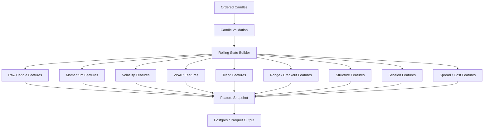
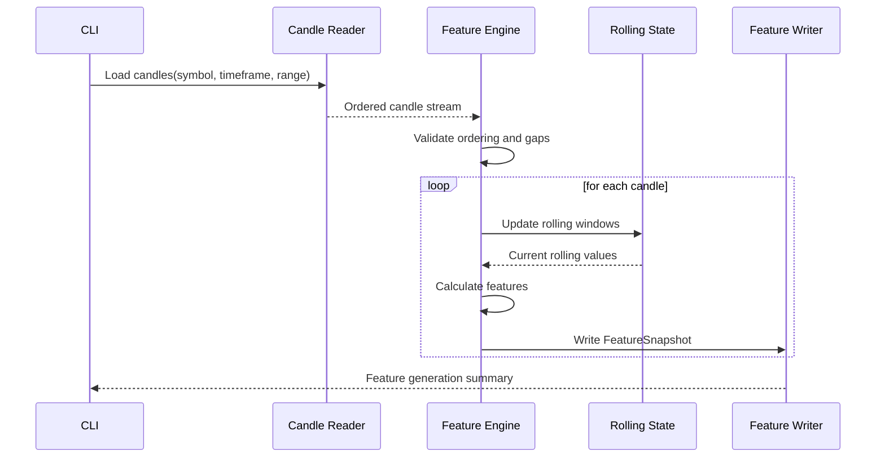
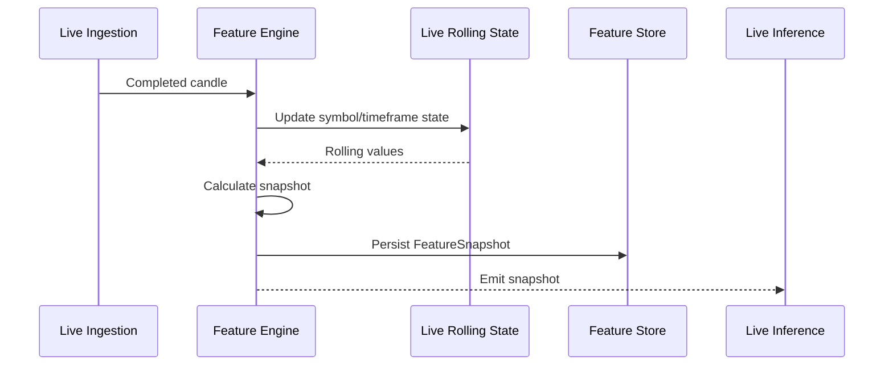
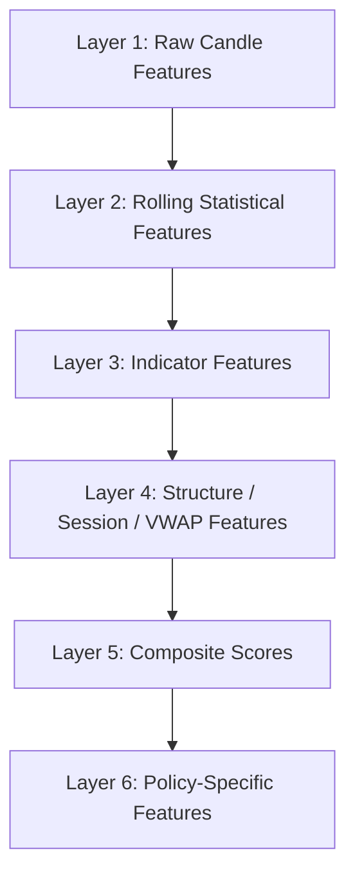

# Component: Rust Feature Engine

## Purpose

The Rust feature engine is the canonical source of market-state feature calculation.

It converts ordered candle data into deterministic `FeatureSnapshot` records that are used by:

```text
regime classification
policy generation
backtesting
labelling
ML training
live inference
risk decisions
dashboard explanations
```

The feature engine must be deterministic, versioned and heavily tested.

## Core principle

The production system and the training pipeline must use the same feature definitions.

```text
Rust generates canonical features.
Python trains on Rust-generated feature matrices.
Live inference uses Rust-generated features.
```

This prevents training/serving skew.

## High-level flow



## Batch feature generation



## Live feature generation



## Inputs

### Candle stream

```json
{
  "symbol": "AAPL",
  "timeframe": "1Min",
  "timestamp": "2026-07-02T14:31:00Z",
  "open": 100.12,
  "high": 100.30,
  "low": 100.05,
  "close": 100.22,
  "volume": 18200,
  "trade_count": 94,
  "vwap": 100.18,
  "source": "alpaca"
}
```

### Feature configuration

```json
{
  "feature_schema_version": "v1.0.0",
  "atr_period": 14,
  "atr_percentile_window": 100,
  "ema_periods": [20, 50],
  "rsi_period": 14,
  "range_window": 20,
  "volume_window": 20,
  "session_timezone": "UTC",
  "swing_left_bars": 2,
  "swing_right_bars": 2
}
```

## Output

### FeatureSnapshot

```json
{
  "symbol": "AAPL",
  "timeframe": "1Min",
  "timestamp": "2026-07-02T14:31:00Z",
  "feature_schema_version": "v1.0.0",
  "calculation_config_hash": "sha256:...",
  "features": {
    "body_pct_of_range": 0.58,
    "close_position_in_range": 0.68,
    "return_5_atr_normalized": 0.42,
    "atr_14": 0.31,
    "atr_percentile_100": 0.74,
    "distance_to_vwap_atr": 0.81,
    "ema_20_slope": 0.12,
    "range_compression_20": 0.46,
    "spread_atr_ratio": 0.05,
    "session": "NEW_YORK",
    "trend_score": 0.67,
    "breakout_score": 0.44,
    "mean_reversion_score": 0.31
  }
}
```

## Internal Rust crate structure

```text
crates/feature-engine/
  src/
    lib.rs
    config.rs
    snapshot.rs
    raw.rs
    returns.rs
    volatility.rs
    vwap.rs
    trend.rs
    range.rs
    structure.rs
    session.rs
    volume.rs
    spread.rs
    composite.rs
    rolling/
      mod.rs
      window.rs
      mean.rs
      stddev.rs
      high_low.rs
      atr.rs
      ema.rs
      percentile.rs
```

## Rolling state primitives

The feature engine should avoid repeatedly scanning historical windows.

Required rolling primitives:

```text
RollingWindow<T>
RollingMean
RollingStdDev
RollingHighLow
RollingATR
RollingEMA
RollingRSI
RollingVWAP
RollingPercentile
RollingVolumeStats
SessionState
SwingState
```

## Feature calculation layers



### Layer 1: raw candle features

```text
body_abs
range
upper_wick
lower_wick
body_pct_of_range
upper_wick_pct_of_range
lower_wick_pct_of_range
close_position_in_range
body_atr_ratio
range_atr_ratio
```

### Layer 2: returns and statistics

```text
return_1
return_3
return_5
return_10
rolling_mean_20
rolling_std_20
return_zscore_20
range_percentile_100
```

### Layer 3: indicators

```text
atr_14
atr_percentile_100
ema_20
ema_50
rsi_14
session_vwap
rolling_vwap
```

### Layer 4: market context

```text
distance_to_vwap_atr
ema_20_slope
ema_20_above_ema_50
range_compression_20
distance_to_range_high_atr
distance_to_range_low_atr
recent_swing_high
recent_swing_low
session
minutes_since_session_open
```

### Layer 5: composite scores

```text
trend_score
mean_reversion_score
breakout_score
compression_score
exhaustion_score
liquidity_score
risk_reward_score
setup_quality_score
```

## Determinism requirements

Given the same:

```text
input candles
feature schema version
calculation configuration
session calendar
spread inputs
```

The engine must produce the same feature snapshots.

Do not use:

```text
implicit system clock
unordered hash iteration for output ordering
randomness without explicit seed
future candles
full-dataset normalization
```

## Leakage prevention

Feature calculations must only use data available at or before the snapshot timestamp.

Valid:

```text
ATR percentile using previous 100 completed candles
session high so far
rolling high over previous completed candles
```

Invalid:

```text
final session high before the session is complete
future max favourable excursion
future high/low used as input
normalization using the full dataset
```

## Warmup handling

Some features require a minimum number of candles.

Example:

```text
atr_14 requires 14+ candles
atr_percentile_100 requires 100+ ATR values
ema_50 requires warmup period
rsi_14 requires 14+ candles
```

Feature snapshots should include a readiness indicator:

```json
{
  "is_warm": false,
  "missing_feature_reasons": ["atr_percentile_100_insufficient_history"]
}
```

Training should exclude snapshots that are not sufficiently warm for the selected schema.

## Error handling

Feature generation should fail fast for:

```text
out-of-order candles
invalid OHLC values
duplicate timestamp within symbol/timeframe
unknown timeframe
unknown feature schema version
```

Feature generation may continue with warnings for:

```text
missing volume
missing spread
known market closure gap
optional provider metadata missing
```

## Unit test examples

```text
calculates candle body and wick percentages correctly
calculates ATR from known fixture
calculates EMA from known fixture
calculates RSI from known fixture
resets session VWAP correctly
excludes future candles from rolling high
computes range compression from historical window only
flags insufficient warmup correctly
```

## Integration test examples

```text
generates identical snapshots from Postgres and Parquet sources
produces deterministic output across repeated runs
handles multi-symbol batch correctly
aligns higher-timeframe features to lower-timeframe snapshots
produces expected feature count for schema v1.0.0
```

## Performance considerations

Batch processing should stream candles rather than load all symbols into memory when possible.

Recommended design:

```text
partition by symbol/timeframe
process one ordered stream at a time
write output incrementally
use columnar Parquet for large feature matrices
parallelize by symbol/timeframe partition
```

## CLI commands

```text
trade-engine features generate \
  --input data/candles/source=alpaca/symbol=AAPL/timeframe=1Min \
  --output data/features/schema=v1.0.0/symbol=AAPL/timeframe=1Min \
  --schema v1.0.0

trade-engine features inspect \
  --symbol AAPL \
  --timeframe 1Min \
  --timestamp 2026-07-02T14:31:00Z
```

## Build order

1. Implement market-core candle/timeframe types.
2. Implement raw candle features.
3. Implement rolling window primitives.
4. Implement ATR, EMA, RSI.
5. Implement session VWAP.
6. Implement range and compression features.
7. Implement swing structure features.
8. Implement spread/cost features.
9. Implement composite scores.
10. Implement batch CLI.
11. Implement live rolling-state adapter.

## Open decisions

```text
Should all features be numeric, or should categoricals be emitted separately?
Should FeatureSnapshot output preserve a strict ordered schema array for ML?
Should Rust emit both JSON and Parquet?
How should feature nulls be represented in Parquet?
Should composite scores be hardcoded first or config-driven?
```
