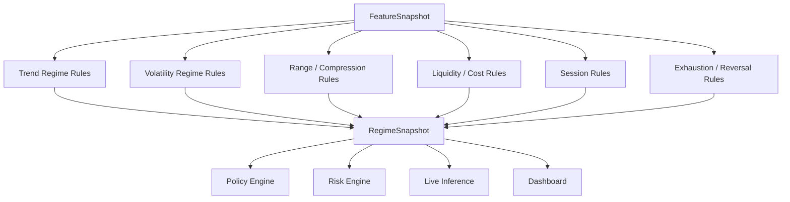
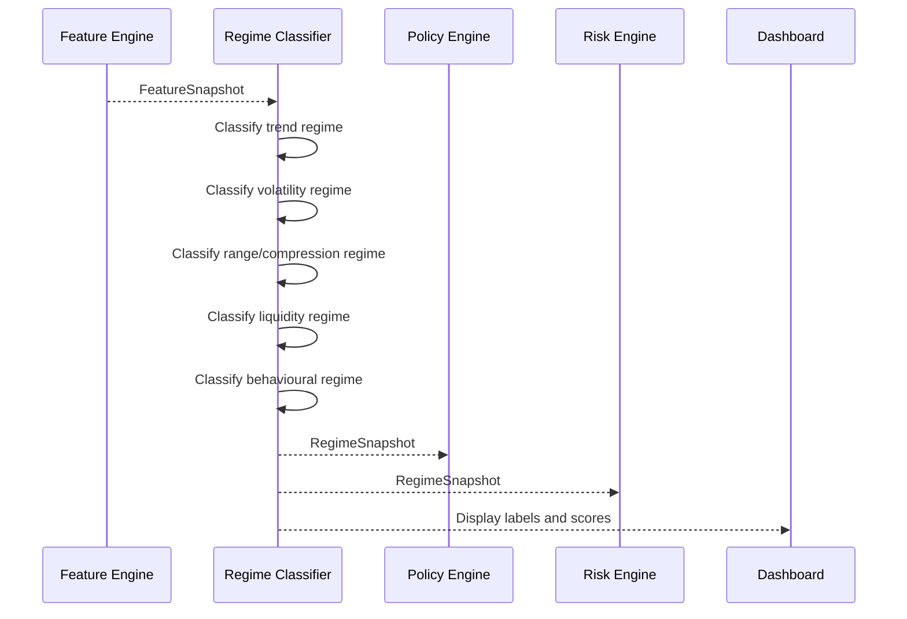

# Component: Regime Classifier

## Purpose

The regime classifier converts low-level feature snapshots into higher-level market-state labels and scores.

It helps the system understand whether the current market is:

```text
trending
ranging
volatile
compressed
expanding
mean-reverting
breakout-prone
illiquid
choppy
exhausted
```

These regime outputs are used by the policy engine, risk engine, live inference engine and dashboard.

## Initial approach

Start with deterministic rule-based classification before introducing ML-based regime clustering.

Why:

```text
easier to inspect
easier to test
easier to explain in the UI
better baseline for later ML comparison
```

## High-level flow



## Output contract

### RegimeSnapshot

```json
{
  "symbol": "AAPL",
  "timeframe": "1Min",
  "timestamp": "2026-07-02T14:31:00Z",
  "regime_schema_version": "v1.0.0",
  "labels": {
    "trend": "bullish_trend",
    "volatility": "high_volatility",
    "range_state": "compressed",
    "liquidity": "normal_liquidity",
    "session": "new_york_open",
    "behavioural": "pullback_continuation_candidate"
  },
  "scores": {
    "trend_strength": 0.72,
    "range_bound_score": 0.22,
    "compression_score": 0.68,
    "breakout_potential": 0.61,
    "mean_reversion_pressure": 0.31,
    "chop_score": 0.18,
    "execution_quality": 0.88
  }
}
```

## Regime groups

## Trend regime

Possible labels:

```text
strong_bullish_trend
weak_bullish_trend
range_bound
weak_bearish_trend
strong_bearish_trend
mixed_trend
```

Inputs:

```text
ema_20_slope
ema_50_slope
ema_20_above_ema_50
market_structure_bias
higher_high_count
higher_low_count
lower_high_count
lower_low_count
htf_trend_direction
ltf_htf_trend_alignment
```

Example rule:

```text
if ema_20_above_ema_50
and ema_20_slope > threshold
and market_structure_bias == bullish
and htf_trend_direction == bullish
then strong_bullish_trend
```

## Volatility regime

Possible labels:

```text
low_volatility
normal_volatility
high_volatility
extreme_volatility
volatility_expanding
volatility_contracting
```

Inputs:

```text
atr_percentile_100
atr_change_20
volatility_expansion_ratio
range_atr_ratio
realized_volatility_20
```

Example rule:

```text
if atr_percentile_100 >= 0.80 then high_volatility
if atr_percentile_100 <= 0.20 then low_volatility
if atr_percentile_100 >= 0.95 then extreme_volatility
```

## Range and compression regime

Possible labels:

```text
wide_range
normal_range
compressed_range
breakout_candidate
failed_breakout_candidate
mid_range_chop
```

Inputs:

```text
range_compression_20
distance_to_range_high_atr
distance_to_range_low_atr
close_above_range_high
close_below_range_low
false_breakout_score
breakout_strength
```

Example rule:

```text
if range_compression_20 < 0.55
and distance_to_range_high_atr < 0.25
and volume_percentile_100 > 0.60
then breakout_candidate_long
```

## Liquidity and execution regime

Possible labels:

```text
excellent_execution
normal_execution
poor_execution
illiquid
spread_elevated
cost_prohibitive
```

Inputs:

```text
spread_atr_ratio
spread_percentile_100
round_trip_cost_atr
expected_move_to_cost_ratio
session
volume_percentile_100
```

Example rule:

```text
if spread_percentile_100 > 0.85
or expected_move_to_cost_ratio < 2.5
then poor_execution
```

## Session regime

Possible labels:

```text
asia_session
london_open
london_session
new_york_open
new_york_session
london_new_york_overlap
rollover
out_of_hours
```

Inputs:

```text
hour_of_day
session
minutes_since_session_open
minutes_until_session_close
is_rollover_period
```

## Behavioural regime

Possible labels:

```text
continuation_candidate
pullback_continuation_candidate
mean_reversion_candidate
breakout_candidate
reversal_candidate
liquidity_sweep_reversal_candidate
no_trade_chop
wait_for_confirmation
```

Inputs:

```text
trend_score
mean_reversion_score
breakout_score
compression_score
exhaustion_score
reversal_score
liquidity_score
risk_reward_score
setup_quality_score
```

## Regime classification sequence



## Deterministic first version

The first version should implement regime classification with transparent thresholds.

Example config:

```json
{
  "regime_schema_version": "v1.0.0",
  "thresholds": {
    "high_volatility_atr_percentile": 0.80,
    "low_volatility_atr_percentile": 0.20,
    "extreme_volatility_atr_percentile": 0.95,
    "compressed_range_ratio": 0.55,
    "elevated_spread_percentile": 0.85,
    "minimum_execution_move_to_cost": 2.5
  }
}
```

## Later ML regime classification

Later, regime labels can be enhanced with:

```text
clustering of feature snapshots
hidden Markov models
sequence models
self-supervised state embeddings
instrument-specific regime profiles
```

But deterministic regimes should remain as an explainability and risk-control layer.

## Testing requirements

```text
classifies high volatility from ATR percentile
classifies low volatility from ATR percentile
classifies rollover period correctly
classifies spread-elevated regime
classifies breakout candidate near compressed range edge
classifies no-trade chop when conflicting inputs exist
produces stable labels for identical feature snapshots
```

## UI display recommendation

The dashboard should show regimes as a compact explanation:

```text
Regime: Bullish trend / high volatility / London session / pullback-continuation candidate
Execution: Normal
Avoidance: None
```

## Open decisions

```text
Should thresholds be global or instrument-specific?
Should regime labels be mutually exclusive or multi-label?
Should regime snapshots be persisted or derived on demand?
Should regime classification live inside feature-engine or separate crate?
```
