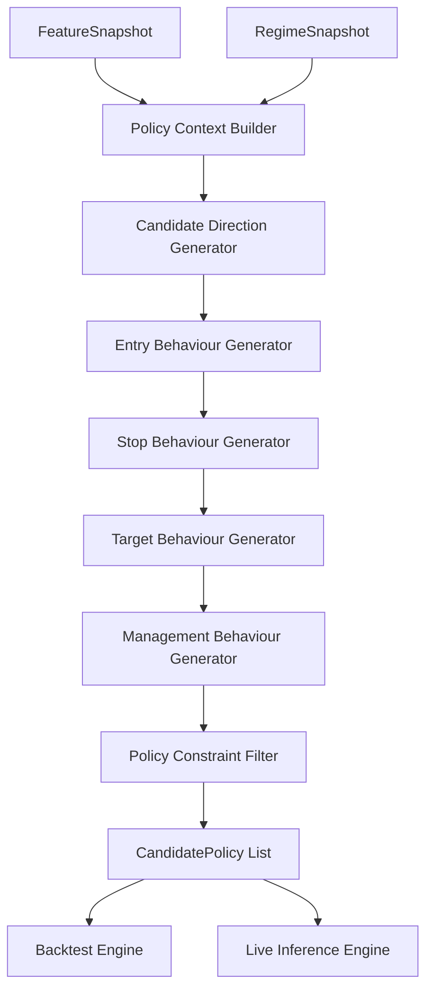
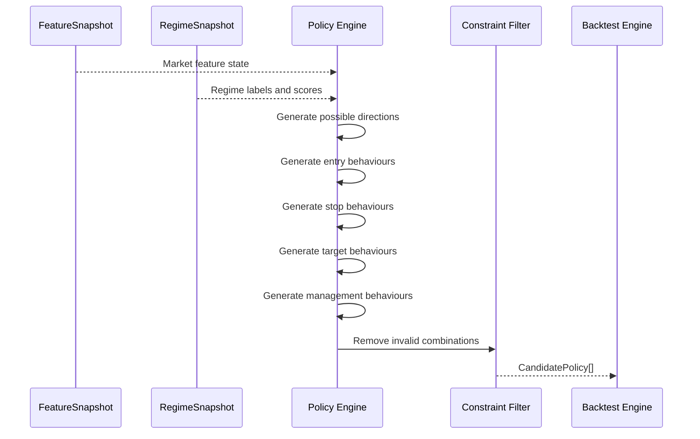

# Component: Policy Engine

## Purpose

The policy engine generates candidate trade behaviours from the current feature and regime state.

It does not decide whether a policy is profitable. It defines the set of valid behaviours that can be simulated, scored, trained against or selected live.

A policy is a structured trade behaviour, not necessarily a named strategy.

## Core concept

Named strategies are bundles of policy components.

Example:

```text
VWAP reversion =
  direction: toward VWAP
  entry: reversal confirmation
  stop: beyond rejection extreme
  target: VWAP / mean
  management: fixed exit or partial at mean
```

Example:

```text
Breakout continuation =
  direction: with breakout
  entry: breakout confirmation or retest
  stop: back inside range
  target: fixed R or prior structure extension
  management: fixed exit or trailing continuation
```

The policy engine should eventually allow the system to compose these behaviours rather than merely choose a named strategy.

## High-level flow



## Initial policy vocabulary

```text
decision:
  trade
  no_trade
  wait

direction:
  long
  short

entry_type:
  immediate
  pullback_confirmation
  breakout_confirmation
  reversal_confirmation

stop_type:
  atr_based
  structural

target_type:
  fixed_r
  prior_high_low
  vwap_or_mean

management:
  fixed_exit
  partial_then_trail
```

## CandidatePolicy contract

```json
{
  "policy_schema_version": "v1.0.0",
  "decision": "trade",
  "direction": "long",
  "entry_type": "pullback_confirmation",
  "stop_type": "structural",
  "target_type": "prior_high_low",
  "management": "partial_then_trail",
  "params": {
    "entry_confirmation_bars": 1,
    "structural_buffer_atr": 0.05,
    "minimum_rr": 1.2,
    "partial_exit_r": 1.0,
    "partial_exit_percent": 0.5
  }
}
```

## Candidate generation sequence



## Direction generation

Direction options:

```text
long
short
```

Direction candidates should be influenced by:

```text
trend regime
higher-timeframe alignment
VWAP position
market structure bias
range position
liquidity sweep direction
mean reversion pressure
```

Example:

```text
If trend regime is strong_bullish_trend and price is pulling back above VWAP, generate long continuation policies.
```

Example:

```text
If price swept below a recent low and closed back inside range, generate long reversal policies.
```

## Entry behaviours

### Immediate

Used when the policy should enter as soon as the signal candle is complete.

Suitable for:

```text
momentum continuation
strong breakout confirmation
post-news impulse if allowed
```

### Pullback confirmation

Requires a retracement to a candidate level and directional confirmation.

Candidate levels:

```text
EMA 20
session VWAP
prior breakout level
recent structure
range mid
```

### Breakout confirmation

Requires a breakout from a defined structure or range.

Candidate triggers:

```text
close above range high
close below range low
body close beyond boundary
breakout followed by retest
```

### Reversal confirmation

Requires signs of exhaustion or failed continuation.

Candidate triggers:

```text
liquidity sweep
rejection candle
close back inside range
extreme VWAP distance
RSI/oscillator stretch
```

## Stop behaviours

### ATR-based

Candidate stop distances:

```text
0.5 ATR
1.0 ATR
1.5 ATR
2.0 ATR
```

### Structural

Candidate structural stops:

```text
below recent swing low for long
above recent swing high for short
outside range boundary
beyond liquidity sweep extreme
beyond rejection candle wick
```

Buffer rule:

```text
buffer = max(2 * spread, 0.05 * ATR)
```

## Target behaviours

### Fixed R

Candidate fixed targets:

```text
1R
1.5R
2R
3R
```

### Prior high/low

Candidate structure targets:

```text
recent swing high
recent swing low
session high
session low
previous day high
previous day low
range high
range low
```

### VWAP or mean

Candidate mean targets:

```text
session VWAP
rolling VWAP
EMA 20
rolling mean
range mid
```

## Management behaviours

### Fixed exit

Single exit at stop or target.

### Partial then trail

Example:

```text
take 50% at 1R
move stop to breakeven at 1R
trail remainder behind recent structure or ATR
```

## Constraint filtering

Invalid combinations should be removed before simulation.

Examples:

```text
vwap_or_mean target invalid if target is behind entry
prior_high_low target invalid if no relevant level exists
structural stop invalid if no swing/structure is available
breakout entry invalid if price is not near a range boundary
pullback entry invalid if no pullback level exists
fixed_r target invalid if risk distance is zero
trade policy invalid if spread/cost makes expected move impossible
```

## No-trade and wait policies

The policy engine must always generate:

```text
no_trade
wait
```

`no_trade` means current conditions are historically unfavourable or execution is poor.

`wait` means a setup may be developing but confirmation is missing.

Example:

```text
Range compression is high, but price has not broken out. Generate wait policy.
```

## Policy expansion path

After v1, add:

```text
liquidity_sweep_reversal
range_edge_fade
opening_range_breakout
vwap_reclaim
trend_pullback
failed_breakout_fade
momentum_scalp
```

These can be represented as named presets over the same policy components.

## Testing requirements

```text
generates no_trade and wait policies for every snapshot
generates long pullback candidates in bullish pullback regime
generates short breakout candidates near lower range boundary
filters structural stops when no structure exists
filters targets with poor risk/reward
produces deterministic candidate ordering
```

## Open decisions

```text
Should candidate generation be exhaustive or regime-pruned?
Should named strategy presets exist as separate types?
How many candidate policies should be generated per snapshot?
Should policy params be fixed initially or optimized by grid search?
```
