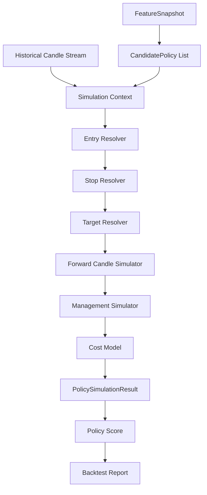
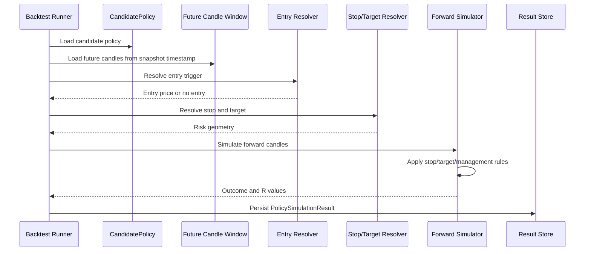

# Component: Backtest Engine

## Purpose

The backtest engine simulates candidate trade policies across historical candles and records the outcome of each policy under realistic execution assumptions.

The backtest engine is the foundation of the labelling process. Without reliable simulation, the ML model will learn poor or misleading labels.

## Responsibilities

```text
simulate candidate policies over historical candles
resolve entry conditions
calculate stop and target levels
simulate stop/target/partial-exit behaviour
apply spread, commission and slippage assumptions
calculate R multiples
calculate max adverse and favourable excursion
score policy outcomes
produce backtest reports
support walk-forward validation windows
```

## Non-responsibilities

```text
ingesting market data
calculating canonical features
training ML models
making live trade decisions
placing broker orders
```

## High-level flow



## Simulation sequence



## Input contracts

### Simulation request

```json
{
  "symbol": "AAPL",
  "timeframe": "1Min",
  "from": "2025-01-01T00:00:00Z",
  "to": "2025-03-31T23:59:59Z",
  "feature_schema_version": "v1.0.0",
  "policy_schema_version": "v1.0.0",
  "cost_model_version": "v1.0.0",
  "same_candle_policy": "conservative"
}
```

### Simulation context

```json
{
  "feature_snapshot_id": "uuid",
  "candidate_policy": {
    "decision": "trade",
    "direction": "long",
    "entry_type": "breakout_confirmation",
    "stop_type": "structural",
    "target_type": "fixed_r",
    "management": "partial_then_trail"
  },
  "future_window_bars": 120
}
```

## Output contract

### PolicySimulationResult

```json
{
  "feature_snapshot_id": "uuid",
  "candidate_policy_id": "uuid",
  "entry_status": "entered",
  "entry_timestamp": "2026-07-02T14:34:00Z",
  "entry_price": 100.42,
  "stop_price": 100.02,
  "targets": [
    {
      "price": 101.02,
      "r": 1.5
    }
  ],
  "outcome": "target_hit",
  "r_multiple": 1.32,
  "gross_r": 1.50,
  "cost_r": 0.18,
  "max_adverse_excursion_r": -0.42,
  "max_favourable_excursion_r": 1.62,
  "duration_bars": 18,
  "score": 0.91
}
```

## Entry resolution

### Immediate entry

```text
enter on next executable price after signal candle closes
```

### Pullback confirmation

```text
wait for pullback into candidate zone
require confirmation candle or trigger
expire if not triggered within N bars
```

### Breakout confirmation

```text
wait for close or body break beyond range/structure
optionally require retest
expire if breakout does not occur within N bars
```

### Reversal confirmation

```text
wait for sweep/rejection/close-back-inside behaviour
enter after confirmation
expire if continuation invalidates reversal premise
```

## Stop resolution

### ATR stop

```text
long_stop = entry_price - atr_multiple * atr
short_stop = entry_price + atr_multiple * atr
```

### Structural stop

```text
long_stop = recent_swing_low - buffer
short_stop = recent_swing_high + buffer
buffer = max(2 * spread, 0.05 * ATR)
```

## Target resolution

### Fixed R

```text
long_target = entry_price + risk_distance * target_r
short_target = entry_price - risk_distance * target_r
```

### Prior high/low

```text
long target candidates: recent swing high, session high, range high
short target candidates: recent swing low, session low, range low
```

### VWAP or mean

```text
long mean target: VWAP/mean above entry
short mean target: VWAP/mean below entry
```

Invalid targets should be rejected before simulation.

## Cost model

Minimum cost model:

```text
spread
commission
slippage
round_trip_cost
```

Approximate execution:

```text
long entry = ask
long exit = bid
short entry = bid
short exit = ask
```

If only mid candles are available, approximate bid/ask using spread.

```text
ask = mid + spread / 2
bid = mid - spread / 2
```

## Same-candle ambiguity

If a candle touches both stop and target, the engine needs a deterministic policy.

Options:

```text
conservative: assume stop hit first
optimistic: assume target hit first
intrabar: use lower-timeframe data if available
```

Initial recommendation:

```text
Use conservative unless lower-timeframe data resolves ordering.
```

The selected assumption must be stored in simulation metadata.

## Management simulation

### Fixed exit

```text
exit full position at stop or target
```

### Partial then trail

Example:

```text
at 1R, exit 50%
move stop to breakeven
after target 1, trail stop behind structure or ATR
exit remainder on final target or trailing stop
```

The result should calculate combined R:

```text
combined_r = sum(exit_size_percent * exit_r)
```

## Policy scoring

Single-trade result scoring:

```text
score =
  r_multiple
  - adverse_excursion_penalty
  - duration_penalty
  - cost_penalty
```

Aggregated policy scoring:

```text
policy_score =
  expectancy_score
  + profit_factor_score
  + win_probability_score
  + sample_size_score
  + regime_consistency_score
  - max_drawdown_penalty
  - losing_streak_penalty
  - cost_penalty
```

## Aggregated metrics

```text
total_trades
entered_trades
expired_setups
wins
losses
win_rate
loss_rate
average_win_r
average_loss_r
average_win_loss_ratio
expectancy_r
profit_factor
max_drawdown_r
largest_losing_streak
average_duration_bars
median_duration_bars
average_mae_r
average_mfe_r
```

## Walk-forward support

The backtest engine should support time windows:

```text
train_start
train_end
validation_start
validation_end
```

Example:

```text
Train: Jan -> Mar
Validate: Apr

Train: Jan -> Apr
Validate: May
```

## Performance considerations

Backtesting can be expensive because it simulates many policies across many candles.

Performance strategy:

```text
partition by symbol/timeframe
parallelize independent partitions
precompute feature snapshots
avoid recalculating indicators during simulation
stream future windows efficiently
cache range/structure values where safe
```

## Testing requirements

```text
long target hit resolves correctly
long stop hit resolves correctly
short target hit resolves correctly
short stop hit resolves correctly
same-candle ambiguity uses configured policy
partial exit R calculation is correct
spread-adjusted execution changes R correctly
expired setups are counted correctly
structural stop buffer is applied correctly
```

## Build order

1. Implement fixed immediate entry simulation.
2. Implement ATR stop and fixed R target.
3. Add spread/cost adjustments.
4. Add structural stops.
5. Add prior high/low targets.
6. Add VWAP/mean targets.
7. Add pullback/breakout/reversal entry resolution.
8. Add partial exit and trailing logic.
9. Add aggregated reports.
10. Add walk-forward runner.

## Open decisions

```text
What max forward window should be used per timeframe?
Should untriggered setups be neutral, negative or excluded?
How should overnight/session boundary exits be handled?
Should slippage be fixed, percentile-based or volatility-based?
Should partial/trailing management be included in v1 or phase 2?
```
