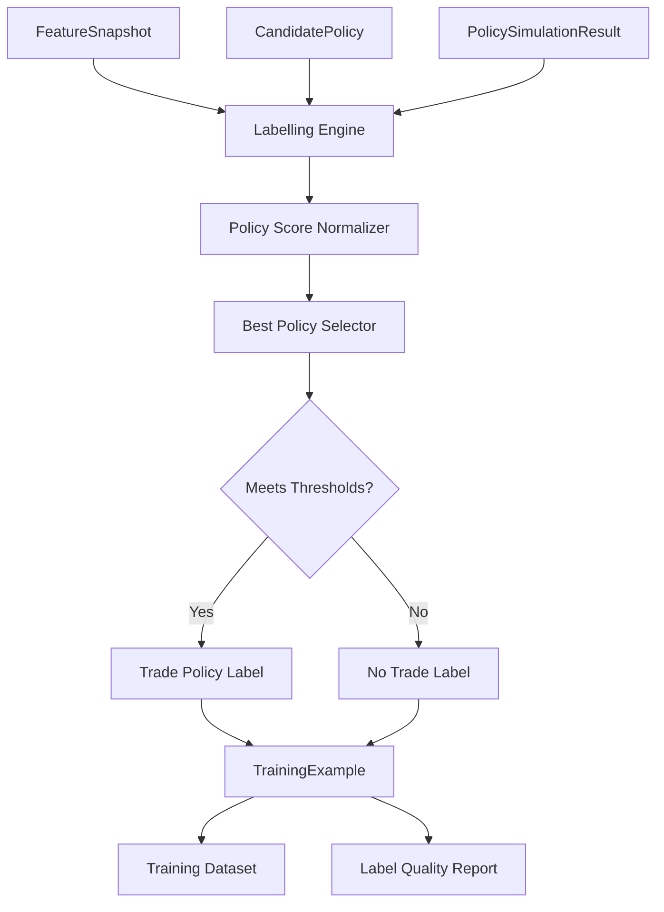
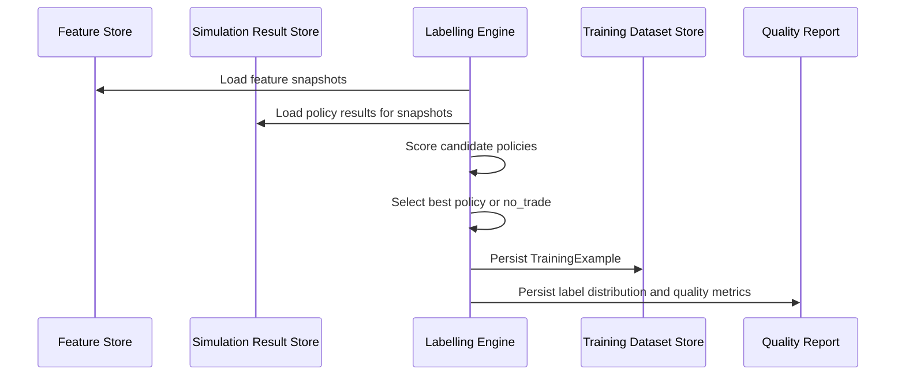

# Component: Labelling Engine

## Purpose

The labelling engine converts historical feature snapshots and policy simulation results into supervised learning labels.

It answers:

```text
Given the market state at this candle, which trade behaviour worked best historically, or should the correct label be no_trade?
```

The labelling engine is central to the system. Poor labels will produce poor models even if the feature engine and ML algorithms are strong.

## Responsibilities

```text
join feature snapshots to candidate policy outcomes
score policy outcomes
select best policy per snapshot
apply minimum quality thresholds
assign no_trade labels when appropriate
generate training examples
version label schema and scoring rules
produce label quality reports
```

## High-level flow



## Labelling sequence



## Input contracts

### FeatureSnapshot

```json
{
  "id": "feature_uuid",
  "symbol": "AAPL",
  "timeframe": "1Min",
  "timestamp": "2026-07-02T14:31:00Z",
  "feature_schema_version": "v1.0.0",
  "features": {
    "atr_percentile_100": 0.72,
    "distance_to_vwap_atr": 0.84,
    "range_compression_20": 0.42
  }
}
```

### PolicySimulationResult

```json
{
  "feature_snapshot_id": "feature_uuid",
  "candidate_policy_id": "policy_uuid",
  "outcome": "target_hit",
  "r_multiple": 1.32,
  "cost_r": 0.18,
  "max_adverse_excursion_r": -0.42,
  "duration_bars": 18,
  "score": 0.91
}
```

## Output contract

### TrainingExample

```json
{
  "feature_snapshot_id": "feature_uuid",
  "feature_schema_version": "v1.0.0",
  "label_schema_version": "v1.0.0",
  "best_policy": {
    "decision": "trade",
    "direction": "long",
    "entry_type": "pullback_confirmation",
    "stop_type": "structural",
    "target_type": "prior_high_low",
    "management": "partial_then_trail"
  },
  "targets": {
    "trade_decision": "trade",
    "direction": "long",
    "entry_type": "pullback_confirmation",
    "stop_type": "structural",
    "target_type": "prior_high_low",
    "management": "partial_then_trail",
    "expected_r": 0.42,
    "win_probability": 0.58,
    "stopout_probability": 0.34,
    "no_trade_probability": 0.21
  },
  "label_metadata": {
    "candidate_count": 48,
    "best_policy_score": 0.91,
    "second_best_policy_score": 0.64,
    "score_margin": 0.27,
    "sample_quality": "good"
  }
}
```

## Best policy selection

For each feature snapshot:

```text
1. Load all candidate policy simulation results.
2. Remove policies that did not pass validity checks.
3. Normalize scores if needed.
4. Select the highest-scoring policy.
5. Compare it against no-trade thresholds.
6. Persist best-policy label or no-trade label.
```

## No-trade labelling

`no_trade` should be selected when:

```text
all policies have negative expectancy
best policy score is below minimum threshold
expected move is too small relative to cost
spread or cost conditions are too poor
candidate count is too low
historical sample confidence is too weak
best and second-best policies are too close and unstable
current regime has poor historical performance
```

Example threshold config:

```json
{
  "minimum_best_policy_score": 0.10,
  "minimum_expected_r": 0.05,
  "minimum_score_margin": 0.05,
  "minimum_candidate_count": 5,
  "maximum_spread_atr_ratio": 0.20,
  "minimum_expected_move_to_cost_ratio": 2.5
}
```

## Label schema versioning

Changing any of these requires a new label schema version:

```text
policy score formula
no-trade threshold
candidate policy vocabulary
simulation assumptions
cost model assumptions
same-candle ambiguity policy
minimum sample thresholds
```

## Target types

The labelling engine should produce multiple target columns.

Classification targets:

```text
trade_decision
best_direction
best_entry_type
best_stop_type
best_target_type
best_management_type
```

Regression targets:

```text
expected_r
expected_duration_bars
expected_mae_r
expected_mfe_r
```

Probability targets:

```text
win_probability
stopout_probability
no_trade_probability
```

## Label confidence

Not all labels are equally reliable.

Useful confidence factors:

```text
score_margin between best and second-best policy
candidate count
sample size in similar historical regime
cost-adjusted result quality
stability across neighbouring candles
stability across walk-forward windows
```

Example:

```text
high confidence: best score 0.92, second score 0.41
low confidence: best score 0.22, second score 0.20
```

Low-confidence examples may be down-weighted during training.

## Dataset balancing

The dataset may become imbalanced.

Common imbalances:

```text
no_trade may dominate
long may dominate in bullish sample periods
some entry types may be rare
some management types may be rare
```

Possible handling:

```text
class weights
downsampling no_trade
minimum per-class sample requirements
instrument/timeframe stratification
regime-stratified evaluation
```

## Label quality report

Each labelling run should produce:

```text
total snapshots
labelled trade examples
labelled no_trade examples
labelled wait examples
class distribution
average best policy score
average score margin
low-confidence label count
excluded snapshot count
excluded reasons
```

Example:

```json
{
  "label_schema_version": "v1.0.0",
  "feature_schema_version": "v1.0.0",
  "total_snapshots": 120000,
  "trade_examples": 38500,
  "no_trade_examples": 73500,
  "wait_examples": 8000,
  "low_confidence_examples": 9400,
  "excluded_examples": 4200
}
```

## Leakage prevention

The labelling engine may use future outcomes to create labels, but these future-derived values must not be included in live input features.

Valid:

```text
future max favourable excursion used to label best historical policy
hit target before stop used as training target
```

Invalid:

```text
future max favourable excursion included in FeatureSnapshot
future session high included as input during live decision
```

## Testing requirements

```text
selects highest-scoring policy when thresholds pass
selects no_trade when all policies are negative
selects no_trade when score margin is too low
excludes invalid policy results
produces deterministic labels from same inputs
increments label schema when scoring config changes
never writes future-derived fields into FeatureSnapshot
```

## Build order

1. Define `TrainingExample` schema.
2. Implement best-policy selection from simulation results.
3. Implement no-trade thresholds.
4. Add label confidence and score margin.
5. Add label quality report.
6. Export training dataset to Parquet.
7. Add class distribution tooling.
8. Add walk-forward dataset splits.

## Open decisions

```text
Should wait be distinct from no_trade in v1?
Should low-confidence labels be excluded or down-weighted?
Should labels be generated globally or per instrument/timeframe?
Should labels optimize one-step policy score or aggregated regime performance?
```
