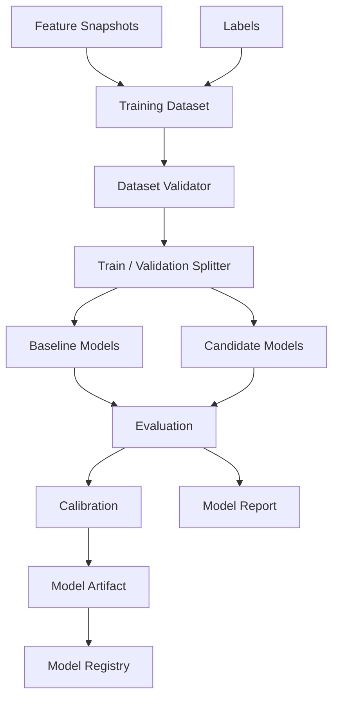
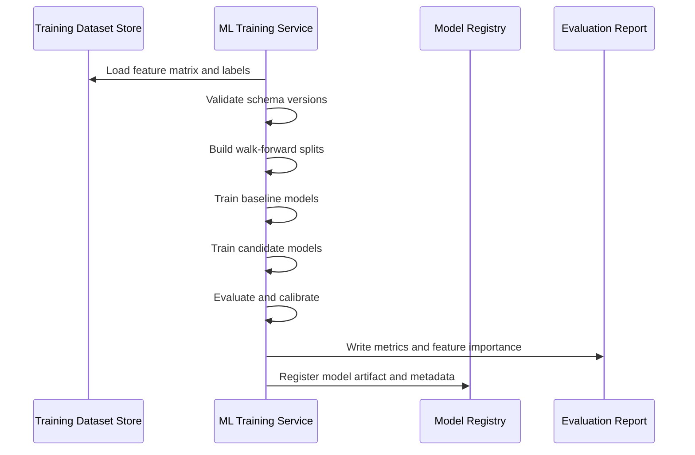
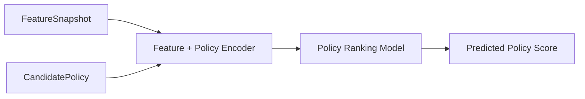

# Component: ML Training Service

## Purpose

The ML training service consumes feature snapshots and labels to train models that can recommend the most favourable trade policy under current market conditions.

The service should not redefine production features. It should train on canonical feature matrices generated by the Rust feature engine.

## Responsibilities

```text
load training datasets
validate feature schema compatibility
train baseline and candidate models
perform walk-forward validation
calibrate probabilities
compute feature importance
produce model evaluation reports
export model artifacts
register model metadata
support live inference integration
```

## Non-responsibilities

```text
candle ingestion
canonical feature calculation
historical policy simulation
risk veto decisions
trade execution
```

## High-level flow



## Training sequence



## Inputs

### Training dataset metadata

```json
{
  "dataset_id": "uuid",
  "feature_schema_version": "v1.0.0",
  "label_schema_version": "v1.0.0",
  "symbols": ["AAPL"],
  "timeframes": ["1Min"],
  "from": "2025-01-01T00:00:00Z",
  "to": "2025-12-31T23:59:59Z",
  "storage_uri": "data/training/label_schema=v1.0.0/feature_schema=v1.0.0/symbol=AAPL/timeframe=1Min/dataset.parquet"
}
```

## Outputs

### ModelRun

```json
{
  "model_name": "policy-selector",
  "model_version": "v0.1.0",
  "feature_schema_version": "v1.0.0",
  "label_schema_version": "v1.0.0",
  "training_start": "2025-01-01T00:00:00Z",
  "training_end": "2025-09-30T23:59:59Z",
  "validation_start": "2025-10-01T00:00:00Z",
  "validation_end": "2025-12-31T23:59:59Z",
  "metrics": {
    "expectancy_lift_vs_baseline": 0.08,
    "trade_decision_accuracy": 0.64,
    "direction_accuracy": 0.58,
    "expected_r_mae": 0.21,
    "win_probability_brier_score": 0.18
  },
  "artifact_uri": "models/policy-selector/v0.1.0",
  "status": "candidate"
}
```

## Initial model targets

Classification:

```text
trade_decision
best_direction
best_entry_type
best_stop_type
best_target_type
best_management_type
```

Regression:

```text
expected_r
expected_duration_bars
expected_mae_r
expected_mfe_r
```

Probability:

```text
win_probability
stopout_probability
no_trade_probability
```

## Recommended first model approach

Start with simple, strong tabular models:

```text
Logistic regression baseline
Random Forest baseline
LightGBM / XGBoost / CatBoost candidate
```

Avoid starting with deep learning. The first challenge is correct labels, validation and cost-adjusted simulation, not model complexity.

## Candidate-policy ranking model

A later but powerful approach is to train a model to score candidate policies directly.

Input:

```text
feature snapshot + candidate policy encoding
```

Output:

```text
predicted policy score
expected_r
win_probability
stopout_probability
```

This allows the live system to generate many valid policies and rank them.



## Walk-forward validation

Use walk-forward validation only. Do not use random train/test splits.

Example:

```text
Fold 1:
  Train: Jan -> Mar
  Validate: Apr

Fold 2:
  Train: Jan -> Apr
  Validate: May

Fold 3:
  Train: Jan -> May
  Validate: Jun
```

## Evaluation metrics

Model quality should be measured by trading-relevant results, not only classification accuracy.

Track:

```text
expectancy lift versus deterministic baseline
profit factor lift versus deterministic baseline
max drawdown
largest losing streak
trade/no-trade precision
trade/no-trade recall
direction accuracy
policy ranking accuracy
expected R error
win probability calibration
stopout probability calibration
regime-specific performance
instrument-specific performance
```

## Probability calibration

If the model predicts a 70% win probability, historical outcomes in that probability bucket should be close to 70%.

Calibration report:

```text
bucket 0.50-0.60 -> actual win rate 0.53
bucket 0.60-0.70 -> actual win rate 0.62
bucket 0.70-0.80 -> actual win rate 0.69
```

Poorly calibrated confidence should not be shown directly in the UI.

## Feature importance

The training service should output feature importance reports.

Useful views:

```text
global feature importance
per-instrument feature importance
per-regime feature importance
feature drift over time
feature importance by target
```

These reports help detect accidental leakage and poor feature design.

## Model promotion criteria

A model can be promoted only if it beats deterministic baselines in walk-forward validation.

Promotion checks:

```text
positive expectancy lift
profit factor improvement
no unacceptable drawdown increase
reasonable sample size
stable across folds
stable across instruments/timeframes
calibrated probabilities
no leakage warning
compatible feature schema
compatible label schema
```

## Model states

```text
draft
candidate
shadow
promoted
deprecated
rejected
```

## Shadow mode

Before live use, a model should run in shadow mode.

In shadow mode:

```text
model produces live recommendations
recommendations are not acted upon automatically
outcomes are tracked
model results are compared to baseline and actual movement
```

## Training/serving skew prevention

Rules:

```text
train only on Rust-generated features
store exact feature_schema_version
store exact calculation_config_hash
reject inference if feature schema is incompatible
reject inference if required features are missing
```

## Testing requirements

```text
rejects incompatible feature schema
builds non-overlapping walk-forward splits
trains baseline model successfully
exports model artifact and metadata
calculates calibration buckets
detects missing required features
compares model against deterministic baseline
```

## Build order

1. Define training dataset format.
2. Build dataset validator.
3. Implement walk-forward splitter.
4. Train baseline trade/no-trade model.
5. Train direction and expected R models.
6. Add calibration reporting.
7. Add model registry write.
8. Add shadow-mode inference endpoint.
9. Add candidate-policy ranking model.

## Open decisions

```text
Should ML service serve predictions directly or export models for another runtime?
Should first model be per instrument or cross-instrument?
Should no_trade be downsampled or class-weighted?
Should low-confidence labels be excluded or down-weighted?
Should model registry use MLflow immediately or a simple database first?
```
