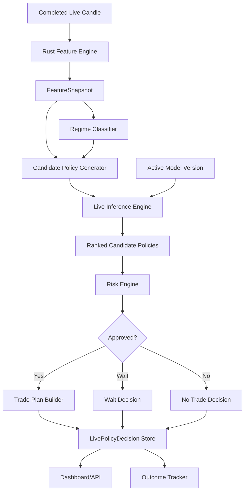
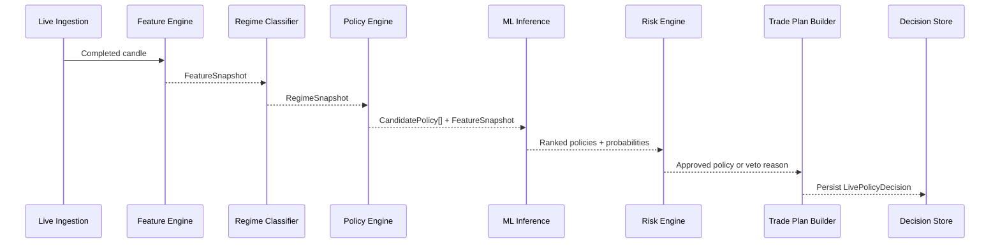
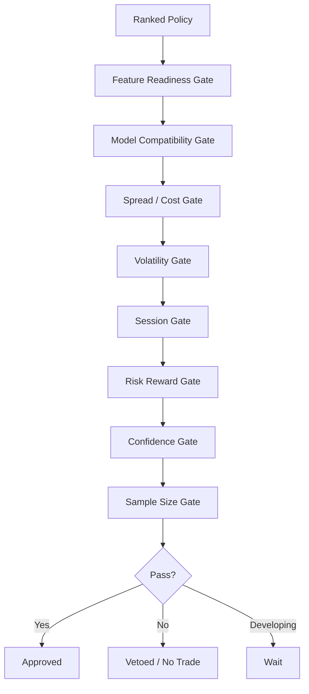

# Component: Live Inference and Risk Engine

## Purpose

The live inference and risk layer converts completed live candle data into a structured trade policy recommendation, then applies deterministic risk controls before a recommendation reaches the dashboard or any future execution layer.

The model may suggest a trade, but the risk engine has final veto authority.

## Responsibilities

```text
consume live feature snapshots
load active model version
generate or receive candidate policies
score candidate policies
select best policy
calculate confidence and expected R
apply deterministic risk gates
produce final trade/wait/no-trade decision
build explainable recommendation payload
persist live decision
track eventual outcome
```

## High-level flow



## Live inference sequence



## Input contract

### Live inference request

```json
{
  "feature_snapshot_id": "uuid",
  "symbol": "AAPL",
  "timeframe": "1Min",
  "timestamp": "2026-07-02T14:31:00Z",
  "feature_schema_version": "v1.0.0",
  "regime_snapshot_id": "uuid",
  "active_model_version": "policy-selector-v0.1.0"
}
```

## Output contract

### LivePolicyDecision

```json
{
  "symbol": "AAPL",
  "timeframe": "1Min",
  "timestamp": "2026-07-02T14:31:00Z",
  "feature_snapshot_id": "uuid",
  "model_version": "policy-selector-v0.1.0",
  "decision": "trade",
  "selected_policy": {
    "direction": "long",
    "entry_type": "pullback_confirmation",
    "stop_type": "structural",
    "target_type": "prior_high_low",
    "management": "partial_then_trail"
  },
  "confidence": 0.71,
  "expected_r": 0.42,
  "win_probability": 0.58,
  "stopout_probability": 0.34,
  "risk_status": "approved",
  "risk_flags": [],
  "reason": [
    "Higher timeframe trend is bullish",
    "Price is above VWAP",
    "Pullback held above recent structure",
    "Spread is normal"
  ]
}
```

## Risk engine responsibilities

The risk engine should be deterministic and conservative.

Risk gates:

```text
spread gate
cost gate
volatility gate
session gate
news/event gate
risk/reward gate
confidence gate
sample-size gate
model compatibility gate
feature readiness gate
instrument state gate
```

## Risk gate flow



## Example vetoes

```json
{
  "risk_status": "vetoed",
  "final_decision": "no_trade",
  "risk_flags": [
    {
      "code": "SPREAD_TOO_WIDE",
      "message": "Spread percentile is above allowed threshold."
    },
    {
      "code": "EXPECTED_MOVE_TOO_SMALL",
      "message": "Expected move to cost ratio is below 2.5."
    }
  ]
}
```

## Trade plan builder

If a policy is approved, the trade plan builder converts the selected policy into concrete levels.

Responsibilities:

```text
calculate entry zone
calculate invalidation level
calculate target levels
calculate R values
calculate management rules
build explanation payload
```

### TradePlan contract

```json
{
  "decision": "trade",
  "direction": "long",
  "entry_zone": {
    "lower": 100.25,
    "upper": 100.38
  },
  "stop": {
    "type": "structural_low",
    "price": 99.92
  },
  "targets": [
    {
      "type": "prior_high",
      "price": 100.96,
      "r": 1.4
    }
  ],
  "management": {
    "take_partial_at_r": 1.0,
    "partial_percent": 0.5,
    "move_stop_to_breakeven_at_r": 1.0,
    "trail_after_target_1": true
  }
}
```

## Wait decision

`wait` should be used when the setup is developing but confirmation is not yet present.

Examples:

```text
range compression exists but breakout has not occurred
price is approaching pullback zone but has not confirmed
liquidity sweep has occurred but close-back-inside confirmation is missing
model confidence is close but below approval threshold
```

## No-trade decision

`no_trade` should be used when trading is currently unfavourable.

Examples:

```text
execution cost too high
volatility too low
volatility too extreme
price is mid-range and risk/reward is poor
conflicting higher-timeframe signals
major event risk present
model has insufficient confidence
```

## Outcome tracking

Each live decision should later resolve to an outcome.

Outcome statuses:

```text
not_triggered
entered
target_hit
stop_hit
expired
cancelled
manual_invalidated
```

Tracked values:

```text
actual_r
max_adverse_excursion_r
max_favourable_excursion_r
duration_bars
entry_timestamp
exit_timestamp
resolution_reason
```

## Shadow mode

The first live phase should be shadow-only.

```text
model produces decisions
risk engine approves/vetoes
system stores recommendation
no trade is placed
outcome tracker evaluates what would have happened
```

## Testing requirements

```text
rejects incompatible feature schema
vetoes high spread decisions
vetoes insufficient confidence decisions
returns wait when setup lacks confirmation
approves valid policy when all gates pass
builds correct entry/stop/target plan
tracks unresolved decisions until expiry
resolves target before stop when lower timeframe confirms order
uses conservative same-candle resolution otherwise
```

## Build order

1. Implement live feature snapshot handoff.
2. Implement active model lookup.
3. Implement simple deterministic policy ranking fallback.
4. Implement risk gates.
5. Implement trade plan builder.
6. Persist `LivePolicyDecision`.
7. Implement shadow outcome tracker.
8. Add dashboard display.
9. Add ML candidate-policy ranking.

## Open decisions

```text
Should live inference call Python or load exported models in Rust?
How long should wait decisions remain valid?
Should trade plans update after every candle or remain fixed?
Should outcome tracking use the same backtest engine logic?
How should manual user confirmation be represented?
```
