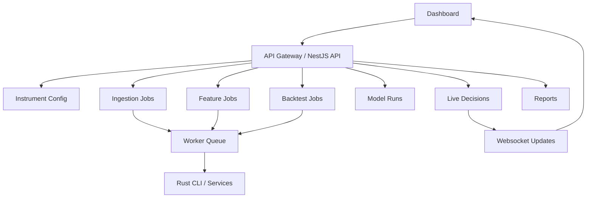

# Component: API and Dashboard

## Purpose

The API and dashboard provide the product-facing layer for configuring instruments, launching research jobs, viewing feature states, inspecting backtest results, reviewing model performance and monitoring live recommendations.

The dashboard should make the system explainable. It should not merely display buy/sell labels.

## Responsibilities

```text
manage configured instruments and timeframes
start ingestion jobs
start feature generation jobs
start backtests
view feature snapshots
view regime classification
view policy leaderboards
view training dataset quality
view model performance
view live recommendations
view outcome tracking
explain risk vetoes and no-trade decisions
```

## High-level API flow



## Main dashboard areas

```text
Instrument Profile
Live Recommendation Monitor
Feature Snapshot Inspector
Regime Viewer
Policy Leaderboard
Backtest Reports
Training Dataset Quality
Model Performance
Risk Veto Explorer
Outcome Tracker
System Health
```

## Instrument Profile

Purpose:

```text
show which behaviours historically work best for a symbol/timeframe
```

Suggested data:

```text
best overall policy behaviour
best session
best volatility regime
worst regime
win rate
expectancy
profit factor
max drawdown
largest losing streak
sample size
```

Example UI card:

```text
Instrument: GBPJPY
Timeframe: 5m
Best Behaviour: Pullback continuation
Best Session: London
Win Rate: 56.8%
Expectancy: +0.28R
Profit Factor: 1.52
Worst Regime: Low-volatility Asia range
```

## Live Recommendation Monitor

Purpose:

```text
show current decision and reasoning
```

Possible states:

```text
trade
wait
no_trade
vetoed
expired
resolved
```

Example card:

```text
Decision: Wait
Regime: compressed / normal spread / London session
Candidate: Breakout confirmation
Reason: range compression is high, but price has not broken range boundary
Risk: no vetoes
```

## Feature Snapshot Inspector

Purpose:

```text
show the raw feature state used by the model and risk engine
```

Sections:

```text
raw candle shape
volatility
trend
VWAP
range/compression
session
spread/cost
higher timeframe
composite scores
```

This view is essential for debugging model behaviour.

## Regime Viewer

Purpose:

```text
translate features into readable market-state labels
```

Example:

```text
Trend: weak bullish trend
Volatility: high but not extreme
Range: compressed near upper boundary
Liquidity: normal
Behavioural regime: breakout candidate
```

## Policy Leaderboard

Purpose:

```text
rank candidate behaviours by historical and model score
```

Example table:

| Rank | Policy | Expected R | Win Prob | Score | Risk Status |
| --- | --- | ---: | ---: | ---: | --- |
| 1 | Long pullback continuation | 0.42 | 58% | 0.81 | Approved |
| 2 | Wait for breakout | 0.31 | 54% | 0.68 | Wait |
| 3 | Short reversal | -0.08 | 41% | 0.18 | Rejected |

## Backtest Reports

Reports should include:

```text
win rate
average win
average loss
expectancy
profit factor
max drawdown
largest losing streak
average duration
MAE/MFE
session performance
regime performance
policy performance
```

Recommended visual sections:

```text
equity curve in R
monthly expectancy
drawdown curve
policy distribution
session heatmap
regime performance matrix
```

## Training Dataset Quality

Purpose:

```text
show whether labels are useful and balanced
```

Useful metrics:

```text
total examples
trade / no_trade / wait distribution
long / short distribution
entry type distribution
average score margin
low-confidence labels
excluded examples
missing feature count
```

## Model Performance

Purpose:

```text
show whether the model improves over deterministic baselines
```

Metrics:

```text
expectancy lift
profit factor lift
trade/no-trade precision
direction accuracy
policy ranking accuracy
expected R error
win probability calibration
performance by fold
performance by regime
performance by instrument
```

## Risk Veto Explorer

Purpose:

```text
explain why the system rejected or downgraded a candidate policy
```

Example vetoes:

```text
SPREAD_TOO_WIDE
EXPECTED_MOVE_TOO_SMALL
VOLATILITY_TOO_EXTREME
CONFIDENCE_TOO_LOW
POOR_RISK_REWARD
INSUFFICIENT_SAMPLE_SIZE
FEATURE_SCHEMA_MISMATCH
```

## Outcome Tracker

Purpose:

```text
track whether live/shadow recommendations worked
```

Statuses:

```text
not_triggered
entered
target_hit
stop_hit
expired
cancelled
manual_invalidated
```

Key fields:

```text
actual R
max adverse excursion
max favourable excursion
duration
entry timestamp
exit timestamp
resolution reason
```

## API endpoints

Suggested endpoints:

```text
GET /instruments
POST /instruments
GET /candles/:symbol/:timeframe
POST /ingestion/historical
POST /features/generate
GET /features/:symbol/:timeframe/:timestamp
POST /backtests
GET /backtests/:id
GET /reports/instrument-profile/:symbol/:timeframe
POST /labels/generate
POST /models/train
GET /models
GET /models/:id
GET /live-decisions
GET /live-decisions/:id
GET /outcomes/:decisionId
```

## Websocket events

```text
CandleCompleted
FeatureSnapshotGenerated
LiveDecisionCreated
RiskVetoRaised
DecisionResolved
BacktestProgressUpdated
TrainingProgressUpdated
```

## Dashboard principle

The UI should always answer:

```text
What did the system decide?
Why did it decide that?
What evidence supports the decision?
What could invalidate it?
How has this behaviour performed historically?
What risk controls were applied?
```

## Build order

1. Instrument and timeframe configuration.
2. Historical ingestion job UI.
3. Feature generation job UI.
4. Instrument profile report.
5. Backtest report view.
6. Feature snapshot inspector.
7. Regime viewer.
8. Live recommendation monitor.
9. Model performance dashboard.
10. Outcome tracker.

## Open decisions

```text
Should dashboard be part of this repo or a separate app?
Should API expose raw feature JSON or typed sections?
Should reports be precomputed or generated on demand?
Should live decisions be shown as alerts, cards or timelines?
```
